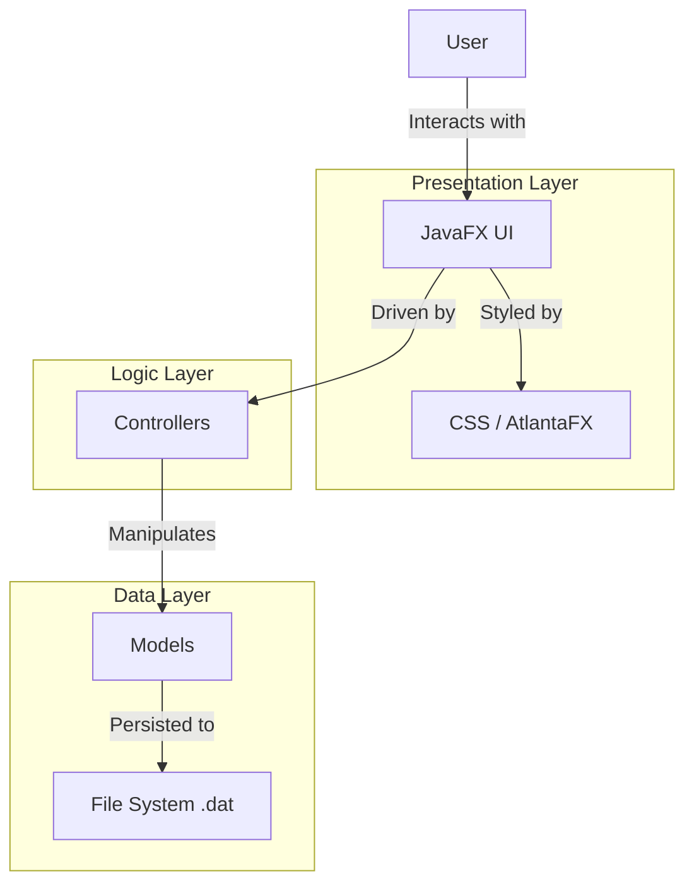
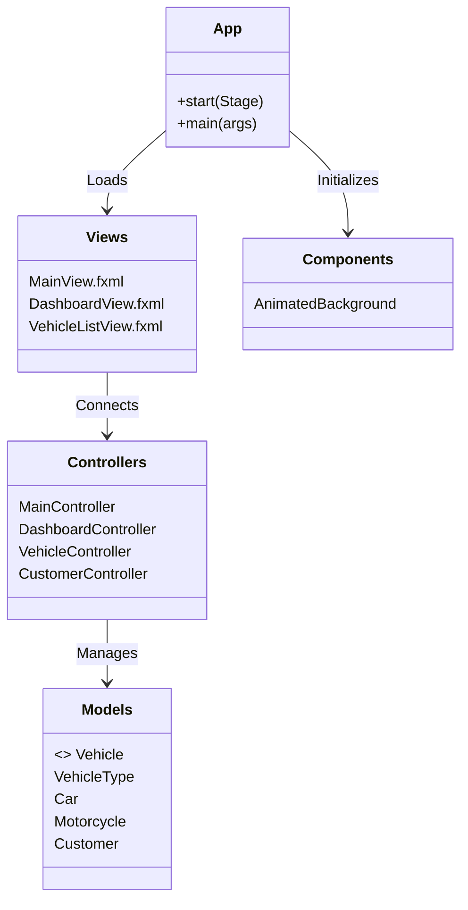

# ⚡ Vehicle Shop Management System

> A modern, JavaFX-based vehicle management system featuring a stunning dark aesthetic, animated backgrounds, and seamless data persistence.


## ✨ Features

- **Modern Dark UI Theme**: Custom-styled dark interface with vibrant accents (`#00ff88`, `#00d4ff`, `#ff0080`), semi-transparent panels, and glow effects.
- **Dynamic Background**: Custom `AnimatedBackground` component featuring floating geometric shapes, particles, and grid lines.
- **Modern Theming**: Built on top of **AtlantaFX** (Dracula theme) for cross-platform consistency and modern controls.
- **Comprehensive CRUD**: Full Create, Read, Update, Delete operations for both **Vehicles** (Cars, Motorcycles) and **Customers**.
- **Data Persistence**: Automatic saving and loading of data using serialized storage (`.dat` files).
- **Responsive Layout**: Layered `StackPane` architecture ensuring the UI floats beautifully over the animated background.
- **Advanced Filtering**: Live search and type-based filtering for vehicle inventories.

---

## 🛠️ Technology Stack

The project utilizes a robust stack centered around JavaFX for the presentation layer and standard Java libraries for logic and data.



### Core Technologies

- **Language**: Java 17
- **UI Framework**: JavaFX 21
- **Styling**: CSS3 + AtlantaFX Library (Dracula Theme)
- **Build System**: Gradle
- **Icons**: FontAwesome (via styled buttons)

---

## 🏗️ Application Architecture

The application follows the **MVC (Model-View-Controller)** pattern to ensure separation of concerns and maintainability.



### Key Components

1.  **`AnimatedBackground`**: A custom `Pane` subsystem that handles the rendering loop (`AnimationTimer`) for the geometric background effects.
2.  **`VehicleController`**: Handles the complex logic of displaying, filtering, and editing polymorphic vehicle data.
3.  **`App`**: The entry point that configures the layered scene graph, applying CSS and handling cross-platform window properties.

---

## 🚀 Getting Started

### Prerequisites

- **JDK 17** or higher installed.
- **Git** to clone the repository.

### Installation & Run

1.  **Clone the repository**

    ```bash
    git clone https://github.com/yourusername/vehicle-shop-modern.git
    cd vehicle-shop-modern
    ```

2.  **Run the application** (Linux/macOS)

    ```bash
    ./gradlew run
    ```

    **Run the application** (Windows)

    ```powershell
    .\gradlew.bat run
    ```

### Building for Distribution

To create a distribution zip file including all dependencies:

```bash
./gradlew installDist
```

The executable will be located in `build/install/vehicleshop/bin/`.

---

## 📸 visual Preview

_(Placeholder for screenshots)_

> The interface features a glassmorphism effect, allowing the animated particles to be subtly visible through the data tables and dashboard cards.

---

## 📜 License

This project is licensed under the MIT License - see the LICENSE file for details.


